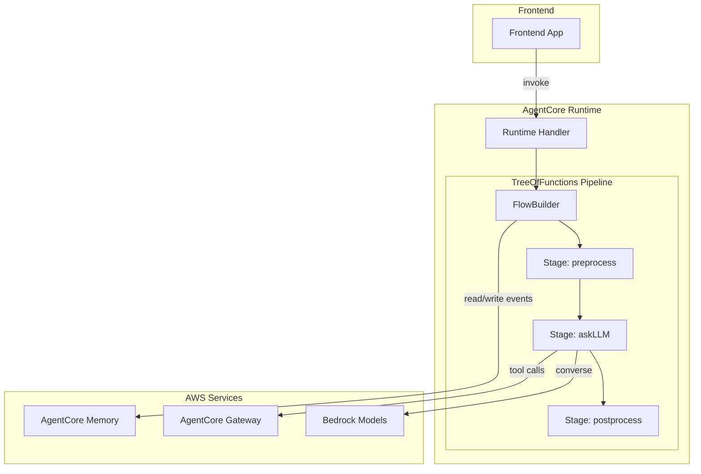

# Design Document: AgentCore Runtime Integration

## Overview

This design integrates TreeOfFunctions as the orchestration layer for building chatbots on AWS AgentCore. The integration provides:

1. **askLLM Stage** - A reusable stage function that invokes Bedrock models
2. **Memory Adapter** - Integration with AgentCore Memory for conversation persistence
3. **Tool Registry** - Registration and execution of tools the LLM can invoke
4. **Runtime Handler** - Wrapper to deploy pipelines to AgentCore Runtime

The architecture leverages TreeOfFunctions' existing capabilities (pipeline execution, state management, parallel/decider patterns) while adding AgentCore-specific integrations.

## Architecture



## Components and Interfaces

### 1. AskLLM Stage Factory

Creates pipeline stage functions that invoke Bedrock models.

```typescript
interface AskLLMConfig {
  modelId: string;                    // e.g., "anthropic.claude-3-sonnet"
  region?: string;                    // AWS region
  maxTokens?: number;                 // Max response tokens
  temperature?: number;               // Model temperature
  systemPrompt?: string;              // System prompt
  tools?: ToolDefinition[];           // Available tools
}

interface ToolDefinition {
  name: string;
  description: string;
  inputSchema: Record<string, unknown>;  // JSON Schema
  handler: (input: unknown) => Promise<unknown>;
}

interface AskLLMScope extends BaseState {
  // Input
  getPrompt(): string;
  getConversationHistory(): Message[];
  
  // Output
  setResponse(response: string): void;
  appendToHistory(message: Message): void;
}

// Factory function
function createAskLLMStage(config: AskLLMConfig): PipelineStageFunction<string, AskLLMScope>;
```

### 2. Memory Adapter

Integrates AgentCore Memory with TreeOfFunctions context.

```typescript
interface MemoryAdapterConfig {
  memoryId: string;                   // AgentCore Memory ID
  region?: string;                    // AWS region
  sessionIdPath?: string[];           // Path in scope to find session ID
}

interface MemoryAdapter {
  // Load conversation history into scope
  loadHistory(sessionId: string, scope: BaseState): Promise<void>;
  
  // Save new messages to memory
  saveEvent(sessionId: string, message: Message): Promise<void>;
  
  // Create middleware stage for automatic memory sync
  createSyncStage(): PipelineStageFunction<void, BaseState>;
}

function createMemoryAdapter(config: MemoryAdapterConfig): MemoryAdapter;
```

### 3. Tool Registry

Manages tools available to the LLM.

```typescript
interface ToolRegistry {
  register(tool: ToolDefinition): void;
  unregister(name: string): void;
  getTools(): ToolDefinition[];
  execute(name: string, input: unknown): Promise<unknown>;
}

function createToolRegistry(): ToolRegistry;
```

### 4. Runtime Handler

Wraps FlowBuilder pipelines for AgentCore Runtime deployment.

```typescript
interface RuntimeHandlerConfig {
  pipeline: FlowBuilder<unknown, BaseState>;
  memoryAdapter?: MemoryAdapter;
}

interface AgentCoreRequest {
  sessionId: string;
  message: string;
  metadata?: Record<string, unknown>;
}

interface AgentCoreResponse {
  response: string;
  sessionId: string;
  metadata?: Record<string, unknown>;
}

// Creates handler compatible with AgentCore Runtime
function createRuntimeHandler(
  config: RuntimeHandlerConfig
): (request: AgentCoreRequest) => Promise<AgentCoreResponse>;
```

## Data Models

### Message

```typescript
interface Message {
  role: 'user' | 'assistant' | 'system';
  content: string;
  timestamp?: number;
  toolCalls?: ToolCall[];
  toolResults?: ToolResult[];
}

interface ToolCall {
  id: string;
  name: string;
  input: unknown;
}

interface ToolResult {
  toolCallId: string;
  output: unknown;
  isError?: boolean;
}
```

### Bedrock Request/Response

```typescript
interface BedrockConverseRequest {
  modelId: string;
  messages: BedrockMessage[];
  system?: string;
  toolConfig?: {
    tools: BedrockToolSpec[];
  };
  inferenceConfig?: {
    maxTokens?: number;
    temperature?: number;
  };
}

interface BedrockMessage {
  role: 'user' | 'assistant';
  content: BedrockContent[];
}

type BedrockContent = 
  | { text: string }
  | { toolUse: { toolUseId: string; name: string; input: unknown } }
  | { toolResult: { toolUseId: string; content: unknown } };
```

## Correctness Properties

*A property is a characteristic or behavior that should hold true across all valid executions of a system-essentially, a formal statement about what the system should do. Properties serve as the bridge between human-readable specifications and machine-verifiable correctness guarantees.*

Based on the prework analysis, the following properties must hold:

### Property 1: Conversation history inclusion
*For any* conversation history array passed to askLLM, the formatted Bedrock request SHALL contain all history messages in the correct order.
**Validates: Requirements 1.3**

### Property 2: Memory event formatting
*For any* context write operation, the generated AgentCore Memory event SHALL contain the message content and valid timestamp.
**Validates: Requirements 2.2**

### Property 3: Tool definition inclusion
*For any* registered tool, the formatted Bedrock request SHALL include the tool's name, description, and input schema.
**Validates: Requirements 5.1**

### Property 4: Handler request-response round trip
*For any* valid AgentCoreRequest, the runtime handler SHALL execute the pipeline and return an AgentCoreResponse containing the session ID from the request.
**Validates: Requirements 6.1, 6.2**

### Property 5: Session ID propagation
*For any* request with a session ID, the handler SHALL pass the session ID to the memory adapter for history retrieval.
**Validates: Requirements 6.3**

### Property 6: Execution metadata completeness
*For any* pipeline execution, the context tree SHALL contain metadata entries for all executed stages with timing information.
**Validates: Requirements 7.1**

### Property 7: Error metadata inclusion
*For any* pipeline execution that encounters an error, the context tree SHALL contain error details including the error message.
**Validates: Requirements 7.3**

Note: Properties related to pipeline execution order (3.1-3.4), context passing (4.1-4.3), and context tree structure (7.2) are already covered by existing TreeOfFunctions tests.

## Error Handling

### Bedrock Errors
- **Throttling**: Retry with exponential backoff, use existing `throttlingErrorChecker`
- **Model errors**: Wrap in descriptive error, include model ID and request details
- **Timeout**: Configurable timeout with clear error message

### Memory Errors
- **Connection failure**: Log warning, continue with local-only context
- **Write failure**: Log error, do not block pipeline execution
- **Read failure**: Return empty history, log warning

### Tool Errors
- **Tool not found**: Return error to model with available tool names
- **Execution failure**: Return error result to model, include error message
- **Timeout**: Configurable per-tool timeout

## Testing Strategy

### Unit Tests
- Test request formatting functions in isolation
- Test error wrapping and propagation
- Test tool registry operations

### Property-Based Tests
The following properties will be tested using fast-check:

1. **Conversation history inclusion** - Generate random message arrays, verify all appear in request
2. **Memory event formatting** - Generate random messages, verify event structure
3. **Tool definition inclusion** - Generate random tool definitions, verify request contains all
4. **Handler round trip** - Generate random requests, verify response structure
5. **Session ID propagation** - Generate random session IDs, verify propagation
6. **Execution metadata completeness** - Generate random pipelines, verify metadata coverage
7. **Error metadata inclusion** - Generate error scenarios, verify error details present

Each property test will run a minimum of 100 iterations.

### Integration Tests
- Test actual Bedrock API calls with mock credentials
- Test AgentCore Memory operations with localstack or mocks
- Test end-to-end pipeline execution with all components
