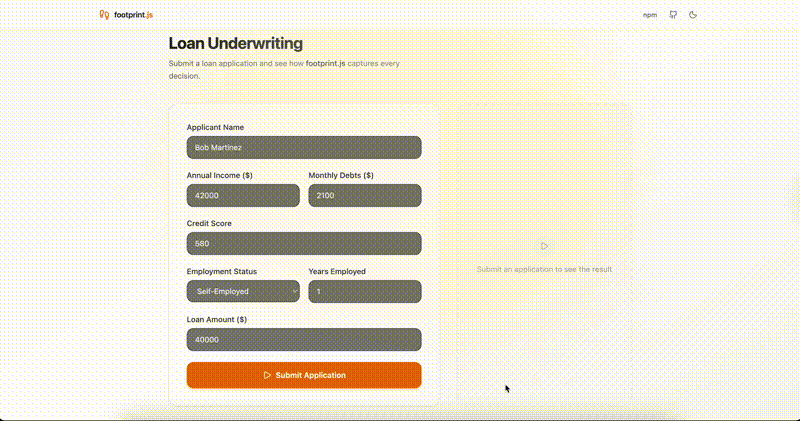

<p align="center">
  <h1 align="center">FootPrint</h1>
  <p align="center">
    <strong>The flowchart pattern for backend code &mdash; self-explainable systems that AI can reason about.</strong>
  </p>
</p>

<p align="center">
  <a href="https://github.com/footprintjs/footPrint/actions"></a>
  <a href="https://www.npmjs.com/package/footprintjs"></a>
  <a href="https://github.com/footprintjs/footPrint/blob/main/LICENSE"></a>
  <a href="https://www.npmjs.com/package/footprintjs"></a>
  <a href="https://footprintjs.github.io/footprint-demo/"></a>
  <a href="https://footprintjs.github.io/footprint-playground/"></a>
</p>

<br>

<p align="center">
  
</p>

**MVC is a pattern for backends. FootPrint is a different pattern** &mdash; the flowchart pattern &mdash; where your business logic is a graph of functions with transactional state. The code becomes self-explainable: AI reads the structure, traces every decision, and explains what happened &mdash; no hallucination.

```bash
npm install footprintjs
```

---

## The Problem

Your LLM needs to explain why your code made a decision. Without structure, it reconstructs reasoning from scattered logs &mdash; expensive, slow, and hallucinates.

| | MVC / Traditional | Flowchart Pattern (FootPrint) |
|---|---|---|
| **LLM explains a decision** | Reconstruct from scattered logs | Read the causal trace directly |
| **Tool descriptions for agents** | Write and maintain by hand | Auto-generated from the graph |
| **State management** | Global/manual, race-prone | Transactional scope with atomic commits |
| **Debugging** | `console.log` + guesswork | Time-travel replay to any stage |

---

## How It Works

A loan pipeline rejects Bob. The user asks: **"Why was I rejected?"**

The runtime auto-generates this trace from what the code actually did:

```
Stage 1: The process began with ReceiveApplication.
  Step 1: Write app = {applicantName, annualIncome, monthlyDebts, creditScore, ...}
Stage 2: Next, it moved on to PullCreditReport.
  Step 1: Read app = {applicantName, annualIncome, monthlyDebts, creditScore, ...}
  Step 2: Write creditTier = "fair"
Stage 3: Next, it moved on to CalculateDTI.
  Step 1: Read app = {applicantName, annualIncome, monthlyDebts, creditScore, ...}
  Step 2: Write dtiRatio = 0.6
  Step 3: Write dtiStatus = "excessive"
Stage 4: Next, it moved on to AssessRisk.
  Step 1: Read creditTier = "fair"
  Step 2: Read dtiStatus = "excessive"
  Step 3: Write riskTier = "high"
[Condition]: A decision was made, and the path taken was RejectApplication.
```

The LLM backtracks: `riskTier="high"` &larr; `dtiStatus="excessive"` &larr; `dtiRatio=0.6` &larr; `app.monthlyDebts=2100`. Every variable links to its cause:

> **LLM:** "Your application was rejected because your debt-to-income ratio of 60% exceeds the 43% maximum, your credit score of 580 falls in the 'fair' tier, and your self-employment tenure of 1 year is below the 2-year minimum."

That answer came from the trace &mdash; not from the LLM's imagination.

---

## Quick Start

```typescript
import { flowChart, FlowChartExecutor, ScopeFacade } from 'footprintjs';

const chart = flowChart('FetchUser', (scope: ScopeFacade) => {
    scope.setValue('user', { name: 'Alice', tier: 'premium' });
  }, 'fetch-user')
  .addFunction('ApplyDiscount', (scope: ScopeFacade) => {
    const user = scope.getValue('user') as any;
    const discount = user.tier === 'premium' ? 0.2 : 0.05;
    scope.setValue('discount', discount);
  }, 'apply-discount')
  .addDeciderFunction('Route', (scope: ScopeFacade): string => {
    return (scope.getValue('discount') as number) > 0.1 ? 'vip' : 'standard';
  }, 'route')
    .addFunctionBranch('vip', 'VIPCheckout', (scope: ScopeFacade) => {
      scope.setValue('lane', 'VIP express');
    })
    .addFunctionBranch('standard', 'StandardCheckout', (scope: ScopeFacade) => {
      scope.setValue('lane', 'Standard');
    })
    .setDefault('standard')
    .end()
  .setEnableNarrative()
  .build();

const executor = new FlowChartExecutor(chart);
await executor.run();

console.log(executor.getNarrative());
// Stage 1: The process began with FetchUser.
//   Step 1: Write user = {name: "Alice", tier: "premium"}
// Stage 2: Next, it moved on to ApplyDiscount.
//   Step 1: Read user = {name: "Alice", tier: "premium"}
//   Step 2: Write discount = 0.2
// Stage 3: A decision was made, and the path taken was VIPCheckout.
//   Step 1: Write lane = "VIP express"
```

> **[Try it in the browser](https://footprintjs.github.io/footprint-playground/)** &mdash; no install needed
>
> **[Browse 25+ examples](https://github.com/footprintjs/footPrint-samples)** &mdash; patterns, recorders, and a full loan underwriting demo

---

## Features

| Feature | Description |
|---------|-------------|
| **Causal Traces** | Every read/write captured &mdash; LLMs backtrack through variables to find causes |
| **Auto Narrative** | Build-time descriptions for tool selection, runtime traces for explanation |
| **7 Patterns** | Linear, parallel fork, conditional, multi-select, subflow, streaming, loops &mdash; [guide](docs/guides/patterns.md) |
| **Transactional State** | Atomic commits, safe merges, time-travel replay &mdash; [guide](docs/guides/scope.md) |
| **PII Redaction** | Per-key or declarative `RedactionPolicy` with audit trail &mdash; [guide](docs/guides/scope.md#redaction-pii-protection) |
| **Flow Recorders** | 8 narrative strategies for loop compression &mdash; [guide](docs/guides/flow-recorders.md) |
| **Contracts** | I/O schemas (Zod/JSON Schema) + OpenAPI 3.1 generation &mdash; [guide](docs/guides/contracts.md) |
| **Cancellation** | AbortSignal, timeout, early termination via `breakFn()` &mdash; [guide](docs/guides/execution.md) |

---

## AI Coding Tool Support

FootPrint ships with built-in instructions for every major AI coding assistant. Your AI tool understands the API, patterns, and anti-patterns out of the box.

```bash
npx footprintjs-setup
```

| Tool | What gets installed |
|------|-------------------|
| **Claude Code** | `.claude/skills/footprint/SKILL.md` + `CLAUDE.md` |
| **OpenAI Codex** | `AGENTS.md` |
| **GitHub Copilot** | `.github/copilot-instructions.md` |
| **Cursor** | `.cursor/rules/footprint.md` |
| **Windsurf** | `.windsurfrules` |
| **Cline** | `.clinerules` |
| **Kiro** | `.kiro/rules/footprint.md` |

---

## Documentation

| Resource | Link |
|----------|------|
| **Guides** | [Patterns](docs/guides/patterns.md) &middot; [Scope](docs/guides/scope.md) &middot; [Execution](docs/guides/execution.md) &middot; [Errors](docs/guides/error-handling.md) &middot; [Flow Recorders](docs/guides/flow-recorders.md) &middot; [Contracts](docs/guides/contracts.md) |
| **Reference** | [API Reference](docs/guides/api-reference.md) &middot; [Performance Benchmarks](docs/guides/performance.md) |
| **Architecture** | [Internals](docs/internals/) &mdash; six independent libraries, each with its own README |
| **Try it** | [Interactive Playground](https://footprintjs.github.io/footprint-playground/) &middot; [Live Demo](https://footprintjs.github.io/footprint-demo/) &middot; [25+ Examples](https://github.com/footprintjs/footPrint-samples) |

---

[MIT](./LICENSE) &copy; [Sanjay Krishna Anbalagan](https://github.com/sanjay1909)
